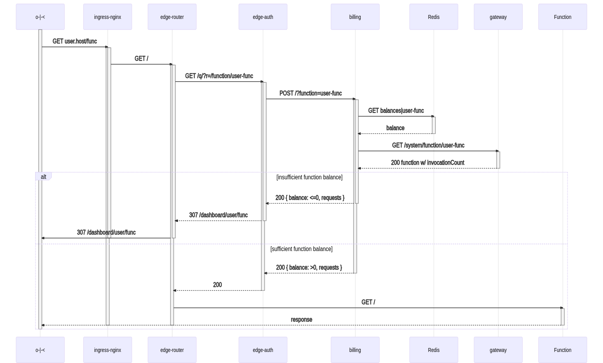
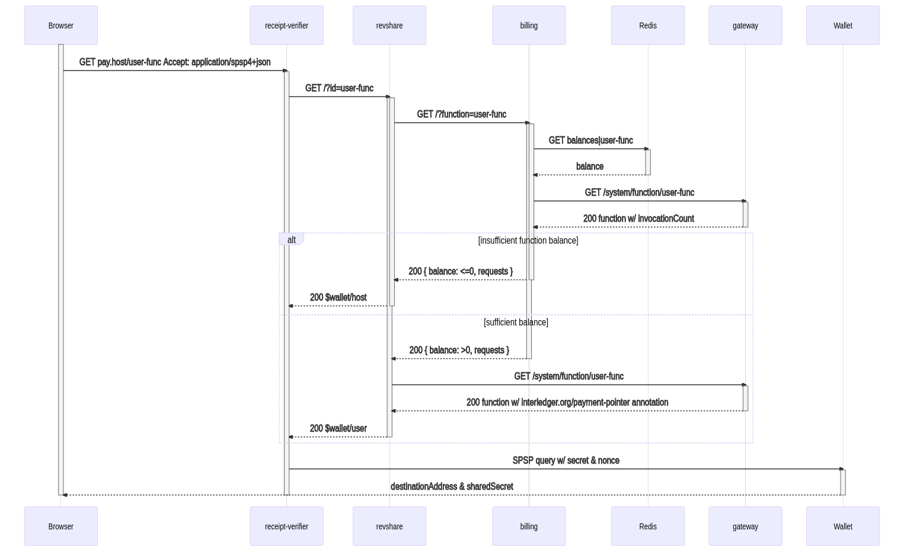
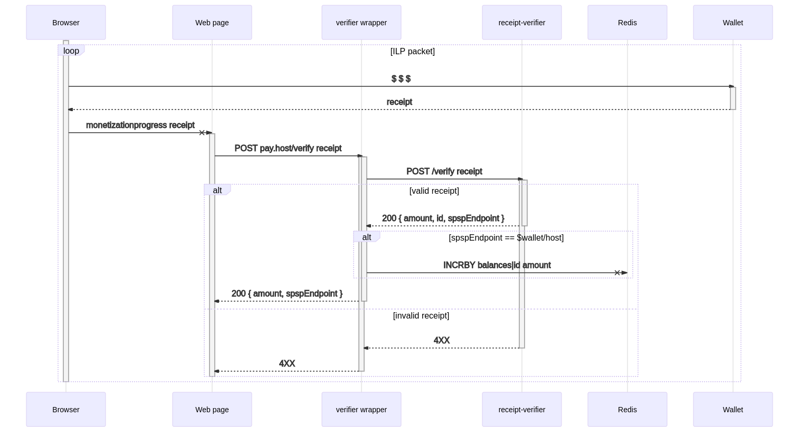

## codius-faas

[](https://github.com/codius/codius-faas/actions)

[Codius](https://codius.org/) Functions as a Service powered by [OpenFaaS Cloud](https://docs.openfaas.com/openfaas-cloud/intro/)

- Serves functions from any repository with the GitHub App installed
- Public dashboard provides code attestion for available functions
- Function invocation requires payment via [web monetization](https://webmonetization.org/)

### Installation

#### OpenFaaS Cloud

Install OpenFaas Cloud with [ofc-bootstrap](https://github.com/openfaas-incubator/ofc-bootstrap/blob/master/USER_GUIDE.md):

- If your [Kubernetes cluster](https://github.com/openfaas-incubator/ofc-bootstrap/blob/master/USER_GUIDE.md#start-by-creating-a-kubernetes-cluster) does not come with [Network Policies](https://kubernetes.io/docs/concepts/services-networking/network-policies/) support, install a [Network Policy provider](https://kubernetes.io/docs/tasks/administer-cluster/network-policy-provider/) such as [Calico](https://docs.projectcalico.org/getting-started/kubernetes/)
- Skip the [Setup your access control](https://github.com/openfaas-incubator/ofc-bootstrap/blob/master/USER_GUIDE.md#setup-your-access-control) and [Use authz](https://github.com/openfaas-incubator/ofc-bootstrap/blob/master/USER_GUIDE.md#use-authz-recommended) steps
- Set [`scale_to_zero`](https://github.com/openfaas-incubator/ofc-bootstrap/blob/master/USER_GUIDE.md#enable-scaling-to-zero) to `true`
- Set [`network_policies`](https://github.com/openfaas-incubator/ofc-bootstrap/blob/master/USER_GUIDE.md#toggle-network-policies-recommended) to `true`

#### Function isolation

Set up a container isolation solution such as [Kata](https://katacontainers.io/) or [gVisor](https://gvisor.dev/).

##### Kata

Install Kata (including your desired `RuntimeClass`) via [kata-deploy](https://github.com/kata-containers/packaging/tree/master/kata-deploy#kubernetes-quick-start).

##### gVisor

Enable [GKE Sandbox](https://cloud.google.com/kubernetes-engine/docs/how-to/sandbox-pods) or install [containerd-shim-runsc-v1](https://gvisor.dev/docs/user_guide/containerd/quick_start/).

#### codius-faas

Update the values in `config.env` for your cluster, then run:

```
KUBECONFIG=/path/to/your/kubeconfig ./install.sh
```

### Components

- modified [openfaas-cloud](https://github.com/wilsonianb/openfaas-cloud)
- modified [faas-netes](https://github.com/wilsonianb/faas-netes/)
- [receipt-verifier](https://github.com/coilhq/receipt-verifier)
- [billing](https://github.com/codius/codius-faas/tree/main/billing) function
- [receipt-verifier](https://github.com/codius/codius-faas/tree/main/receipt-verifier) function
- [revshare](https://github.com/codius/codius-faas/tree/main/revshare) function

### Function Invocation Flow




### SPSP Flow




### Receipts Flow


